# Introduction

The **SAP Cloud Identity Services** offer three services that can be used to manage the users in various SAP products such as SAP S/4HANA cloud and on premise, SAP Ariba and many others

- Identity Directory Service
- Identity Provisioning Service
- Identity Authentication Service

The **Identity Directory Service** provides a system for cross-domain identity management that offers a (SCIM) 2.0 REST API for managing resources (users, groups and custom schemas).

The **Identity Provisioning Service** automates identity lifecycle processes. It helps you provision identities and their authorizations to various cloud and on-premise business applications. As of July the 11th 2022 there is also a REST API available that lets you start synchronization jobs.

The **Identity Authentication Service** provides you with controlled cloud-based access to business processes, applications, and data. It simplifies your user experience through authentication mechanisms, single sign-on, on-premise integration, and convenient self-service options.

In this repository you will find an ABAP SDK that will allow you to access the *Identity Direkctory Services (IDS)* and the *Identity Provisioning Service* from within your ABAP Code. This way you would be able to build integrations that allow you to manage users in your ABAP systems based on information that is stored in your ABAP system where no out-of-the-box integration is available using standard API's or interfaces. 

Using this ABAP SDK it is for example possible to create and update users in your ABAP system for your partners. 

Using the IDS and the IPS you can automate user creation for your partners and you can leverage all the features of SAP IDS, SAP IAS and SAP IPS such as the reset of lost passwords.

# Coding explained

The ABAP SDK consist out of three classes:
- zdmo_cl_manage_custom_ids
- zdmo_cl_user_json_visitor
- zdmo_cl_group_json_visitor

The two json visitor classes **zdmo_cl_user_json_visitor** and **zdmo_cl_group_json_visitor** are used to travers through the json scim responses that we get from the SAP Identity Service when trying to get a list of users or groups. 
The class **zdmo_cl_manage_custom_ids** contains the main logic and provides the following methods:

- get_users_from_ids
  
  This method accepts a query string as it is supported by the SCIM 2.0 REST API. It is send to the http client and added to the GET request. The method returns a list of user ressources. In addition it returns the total number of entries that matched the query, the page size and the starting element.  

- get_user_from_ids_by_email
  
  This method allows you to retrieve the data of a single user based on its email address.
  
- get_user_from_ids_by_extid

  This method allows you to retrieve the data of a single user based on its external id.

- get_groups_from_ids

  This method accepts a query string as it is supported by the SCIM 2.0 REST API. It is send to the http client and added to the GET request. The method returns a list of groups ressources. In addition it returns the total number of entries that matched the query, the page size and the starting element.  

- get_group_from_ids_by_displayn

  This method returns a single group using its displayName as a filter.

- create_user_in_ids

  This user takes basic user data such as the firstname, lastname, email adress and the external name that is used as the employeeid in Steampunk.

- change_user_in_ids

  This method allows you to change a user using a PUT request. All entries that are provided are changed.  

- patch_user_in_ids

  This method just changes the following attributes of a user: firstname, lastname, displayname and email adress. The extern id, that means the employee id in Steampunk can not be changed

- assign_user_to_group_in_ids

  This method allows to assign a user identified by its email adress to a group identified by its displayname.
  
- start_ids_synch

  This method allows you to start a synchronization (READ) job for a specific source system identified by its Id. This way it would be possible to develop an action in a RAP BO that would trigger a sync after changes have been performed. Please not that jobs can not be started if another job has run within the last 30 minutes. 

The methods are documented in the code using ABAP Doc.

An implementation example is given in the method main() of this class.

## method get_payload_create_ids_user

The method get_payload_create_ids_user( ) creates the json scim string which is sent via POST to the IDS server. In my implementation the field **partner_id** that is provided as an input parameter for the method create_user_in_ids( ) is mapped to the property **division** in the IDS.

USER_DATA	Structure: deep	Type T_USER in ZDMO_CL_USER_JSON_VISITOR	

<pre>
ID			
USERNAME	    SHUGO24	
DISPLAYNAME	  Hugo Test24	
EMAIL	        Hugo.Test24@Test.de	
FAMILYNAME	  Test24	
GIVENNAME	    Hugo	
PARTNER_ID	  1234		
EXTERNALID		
</pre>

scim_json

<pre>
{
  "schemas": [
    "urn:ietf:params:scim:schemas:core:2.0:User",
    "urn:ietf:params:scim:schemas:extension:enterprise:2.0:User",
    "urn:ietf:params:scim:schemas:extension:sap:2.0:User"
  ],
  "userName": "SHUGO24",
  "displayName": "Hugo Test24",
  "externalId": "SHUGO24", 
  "name": {
    "givenName": "Hugo",
    "familyName": "Test24" 
  },
  "emails": [
    {
      "value": "Hugo.Test24@Test.de"
    }
  ],
"urn:ietf:params:scim:schemas:extension:enterprise:2.0:User": {
   "division": "1234", 
   "employeeNumber": "SHUGO24" 
},
 "urn:ietf:params:scim:schemas:extension:sap:2.0:User": {
  "sendMail": true ,
  "mailVerified": false
}
}
</pre>

## Mapping of division to department

When creating users from IDS in Steampunk I changed the mapping of the target system in the Identity Provider Service such:

<pre>
            {
                "sourcePath": "$['urn:ietf:params:scim:schemas:extension:enterprise:2.0:User']['division']",
                "optional": true,
                "targetPath": "$.workplaceInformation.department"
            },
</pre>

> **Explanation:**
> The field department in the Identity Directory Service can not be used for arbritrary data. The field expects input based on a list of possible entries. 
> In order to store data about the partner id in the field department of the employee in SAP BTP ABAP Environment the workaround was chosen to store the data in IDS in another 
> field, namely division and to map the IDS field division to the field department in the employee in Steampunk.

## Testing the implementation

After you have setup the integration with your SAP Identity Service you can try out the SDK. To do so the class has implemented the interface if_oo_adt_classrun. 
By pressing F9 the method main will be executed. 

If everything works well you should see an output like the following. When you run it the first time the query will not find any entries.

Searched via filter string: filter=urn:ietf:params:scim:schemas:extension:enterprise:2.0:User:division eq "1234"&startIndex=6&count=5  
External Id: hugo.test5@test.de  
External Id: SHUGO5  
External Id: hugo.test6@test.de  
External Id: SHUGO6  
External Id: hugo.test7@test.de  
External Id: SHUGO7  
External Id: hugo.test8@test.de  
External Id: SHUGO8  
External Id: hugo.test9@test.de  
External Id: SHUGO9  
----------------------------------  
Trying to create Hugo Test24   
Status: 201  User created successfully.  
Get user by username :SHUGO24  
Trying to change Hugo Test24 via PUT  
Status: 200  The user is updated successfully.  
Trying to change Hugo Test24_25 via PATCH  
Status: 204  The user is patched successfully.   
Searched via filter string: filter=userName eq "SHUGO24"  
Givenname: Hugo  
Familyname: Test24_25  
DisplayName: Hugo Test24_25  
EMail: hugo.test24_25@test.de  
Id: 29646a9f-9e4a-4d63-9242-a43f499b0686  
Partner_Id: 1234  
Username: SHUGO24  
External Id: SHUGO24  
----------------------------------  
Tryping to add Hugo Test24 as a member to ZDMO_DEMO_ROLE  
Status: 204  The group is updated successfully.  
status of job api call: 423 reason    
Status: 423 Job cannot be triggered as it has been started before a predefined minimum time interval (30 minutes)   

# How to section

## Prerequisites

In order to leverage this sample code you have to have a installation of the new **SAP Cloud Identity Services** in place. 

> Please note  
> If you are still using an **Identity Provisioning tenant** running on **SAP BTP, Neo environment** you have first to migrate it to the new **SAP Cloud Identity Services** infrastructure as described in this blog post https://blogs.sap.com/2022/08/05/go-for-your-quick-win-migrate-identity-provisioning-tenants-to-sap-cloud-identity-infrastructure . 

# Configuration steps in SAP Cloud Identity Services

## Create a technical administrative user in SAP IAS

The setup of this integration starts in the *Identity Autenticaition Service* where we add a new system  **ZDMO_IPS_IDS_INTEGRATION** to the list of administrators.  

1. Navigate to the admin URL https://rapworkshop.accounts.ondemand.com/admin/
2. Click on **Administrators** 
3. Click on the **+** sign
4. Choose **System** to add a system as an administrator
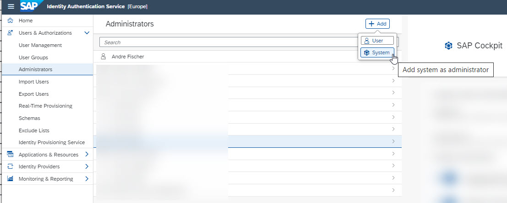

5. Choose a meaningful name such as **ZDMO_IPS_IDS_INTEGRATION**
6. Change the default settings such that the following authorizations are activated:  
   - Manage Users
   - Read Users
   - Manage Groups
   - Manage Tenant Configuration
   - Access Identity Provisioning Tenant Admin API

   > The authorization *Access Identity Provisioning Tenant Admin API* is needed to start the synchronization in the IPS via the new API 
   > that is available as of July 11th this year. 
   > The other 4 authorizations are needed to call the (SCIM) 2.0 REST API's of our IDS service.  

   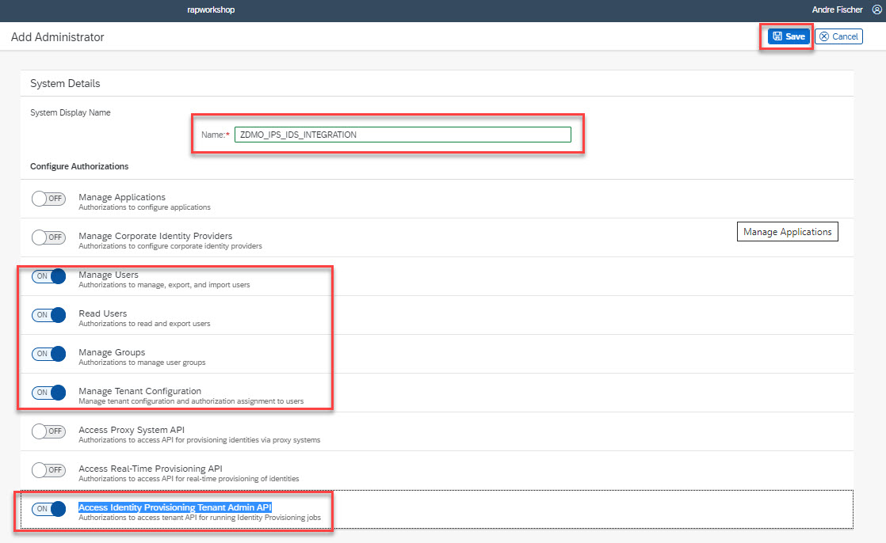

7. Click on **Set Password** 
   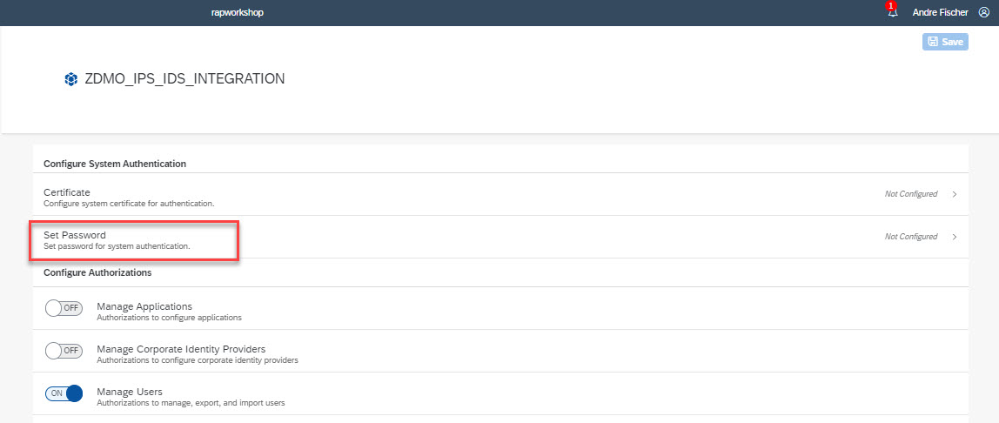

8. Enter a password. The password must fullfill certain requirements such as a lenght of at least 8 characters. In addition it must include three of the following:
   - Uppercase letters  
   - Lowercase Letters  
   - Numbers  
   - Symbols  
   
   > So "Welcome1?" would be sufficient, but not recommended ;-).
    
   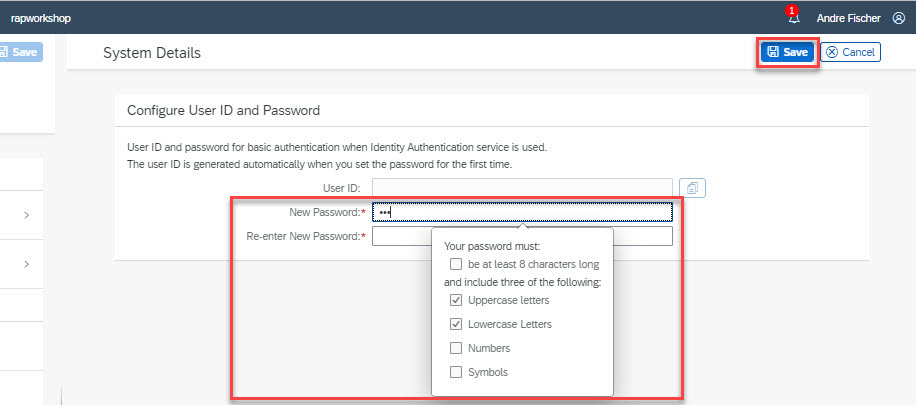

9. This way an external system can use User ID and password for basic authentication when using the Identity Authentication service. Please note, that the user ID is generated automatically when you set the password for the first time.

   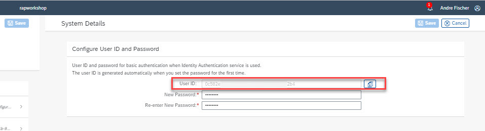

# Configuration steps in SAP BTP ABAP Environment

When calling the REST API of your instance of the IDS we have to provide credentials so that the call is authenticated successfully. For this we will use a communication arrangement. The advantage of using a communication arrangement opposed to using the destination service is, that the whole setup process takes only place in the SAP BTP ABAP Environement system itself. There is NO need to access the underlying SAP BTP sub account where the SAP BTP ABAP Environment system is hosted.

<pre>DATA(destination) = cl_http_destination_provider=>create_by_comm_arrangement( communication_scenario ).</pre>

We will start to create an *outbound http service* and a *communication scenario* using ADT. 
Afterwards we will create a *communication system* and a *communication arrangement* using the administrative Fiori Launchpad. 

## Create a http outbound service using ADT in SAP BTP ABAP Environment 

1. Right click on your package and choose **New --> Other ABAP repository object** 
2. Search for **Outbound Service**, select the entry and choose **Next** 
   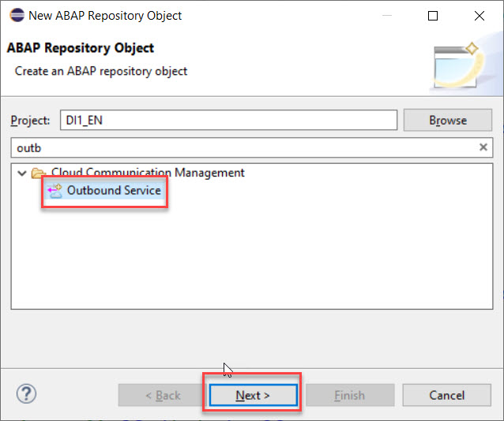
3. Choose a meaningful name such as **ZDMO_IDS_SRV_REST** and select **HTTP Service** as the **Service Type**  
   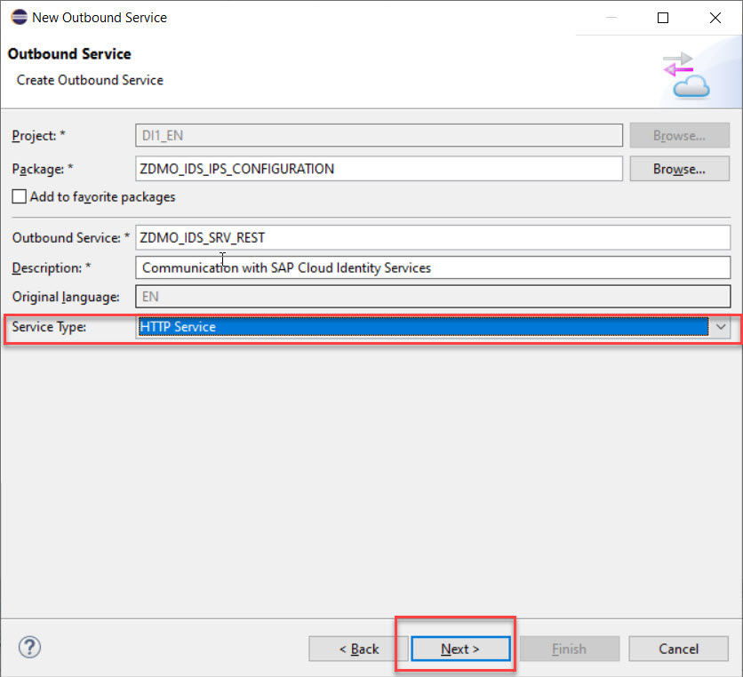
4. At this point we could also enter a default path prefix that would be used as a proposal when creating the communication arrangement, but we don't enter anything here.
   
5. **Save** your changes

## Create communication scenario using ADT in SAP BTP ABAP Environment

1. Right click on your package and choose **New --> Other ABAP repository object** 
2. Search for **Communication scenario**, select the entry and choose **Next**
   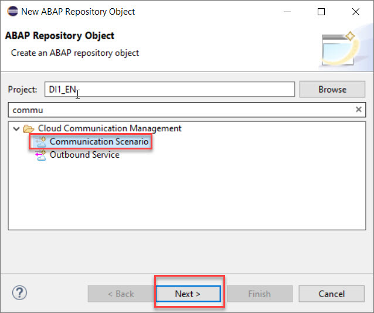  
3. Enter a meaningful name such as **ZDMO_SAP_IDS_INTEGRATION** and press **Next** 
   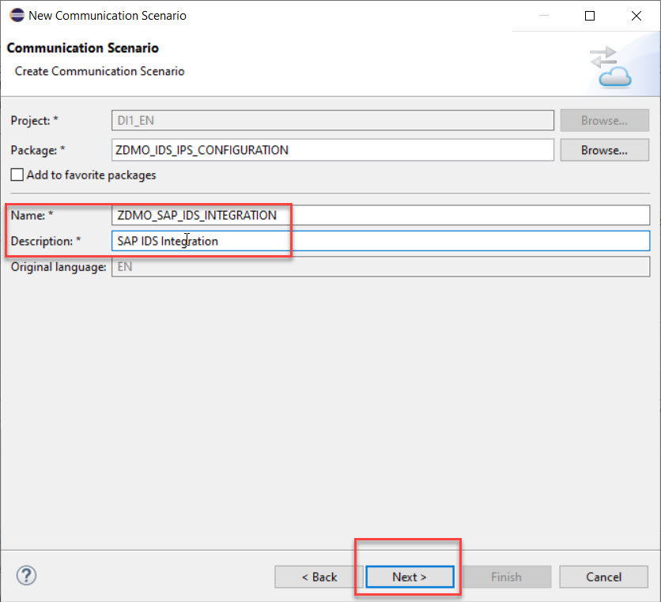 
4. Navigate to the **Outbound** tab
5. Click **Add**
6. Click **Browse** to select the *Outbound Service ID* of the IDS specific outbound service **ZDMO_IDS_SRV_REST**.
   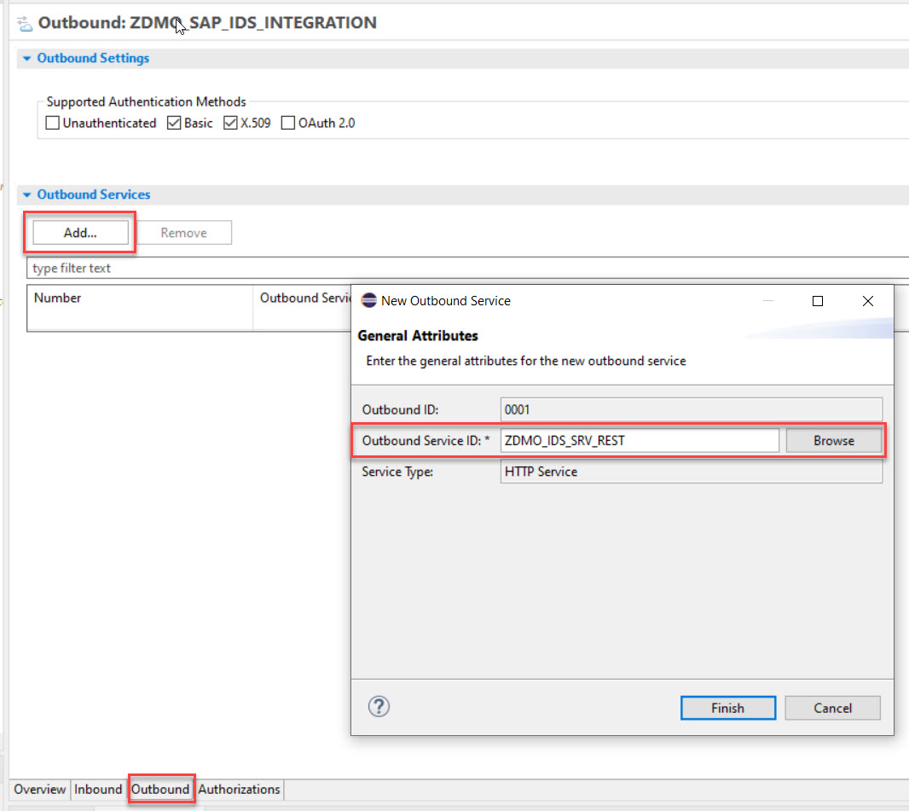
7. Click on **Publish Locally**
   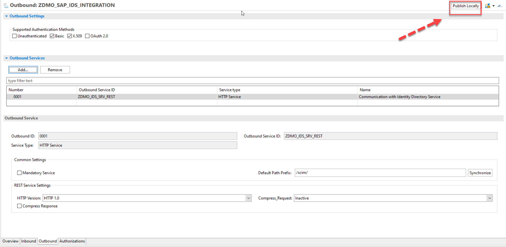

## Create a communication system using the administrative Fiori Launchpad in SAP BTP ABAP Environment 

In the following you will have to create a the *communication arrangement* based on the *communication scenario* algongside with a *communication system*. In the communication syste the credentials of the system user that has been created in SAP IDS will be stored.  

1. Right-click on your project in SAP ADT and click on **Properties**
2. Select **ABAP Development** on the left hand side and then click on the **System URL** to open the administrative Fiori Launchpad
3. Click on the tile **Communication Systems**
   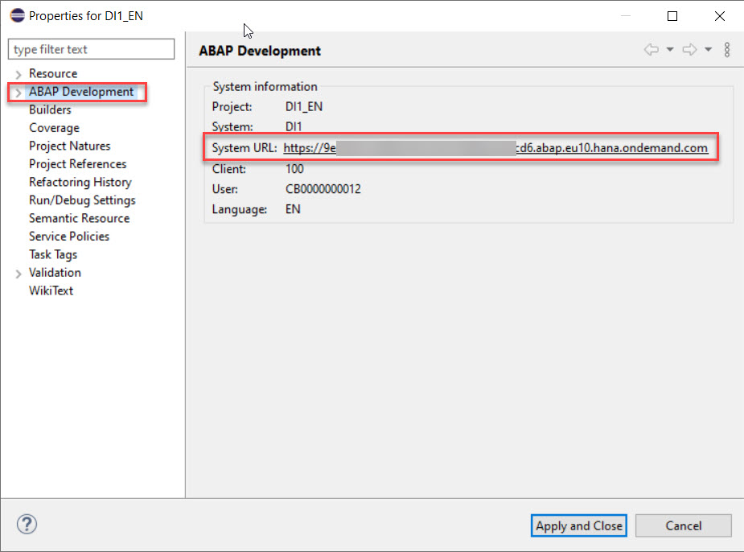
4. Click on **Create**
5. In the *New Communication System* dialogue enter the following values and then press **Create**   
   - System ID: **ZDMO_IDS_INTEGRATION**
   - System Name: **ZDMO_IDS_INTEGRATION**
   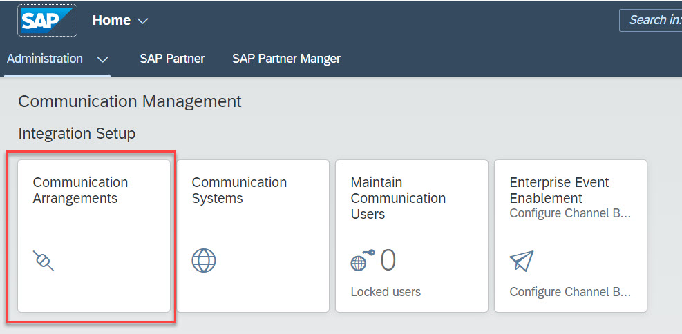
   
6. Enter the hostname of your *Identity Directory Service*  
   - Hostname: rapworkshop.accounts.ondemand.com

   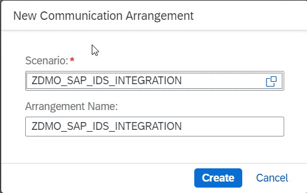
   
7.  Scroll down to the section **Users for Outbound Communication** and press the plus **+** sign.
    
    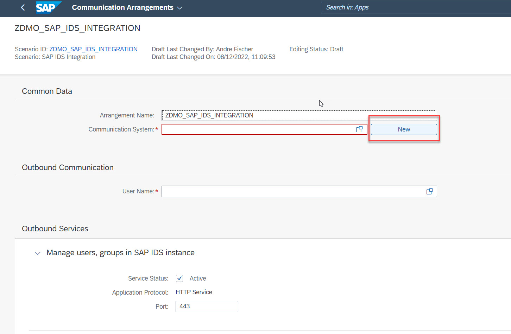
8. In the *New Outbound User* dialogue enter the following values and then press **Create**   
   - Username: 0c582e1b-9e5c-4ed3-abd3-a55b07bb42b4  
   - Password: < the password of the system that you have created as an administrator in SAP IPS> 
9. **Save** your changes.  
   
## Create communication arrangement using the administrative Fiori Launchpad in SAP BTP ABAP Environment 

1. Click on the tile **Communication Arrangements**
   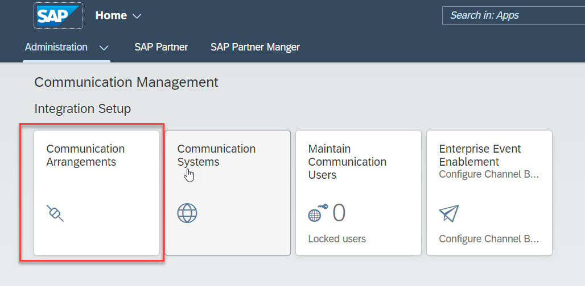
2. Click on **Create**
3. Search for the communication scenario **ZDMO_SAP_IDS_INTEGRATION** that you have created earlier
   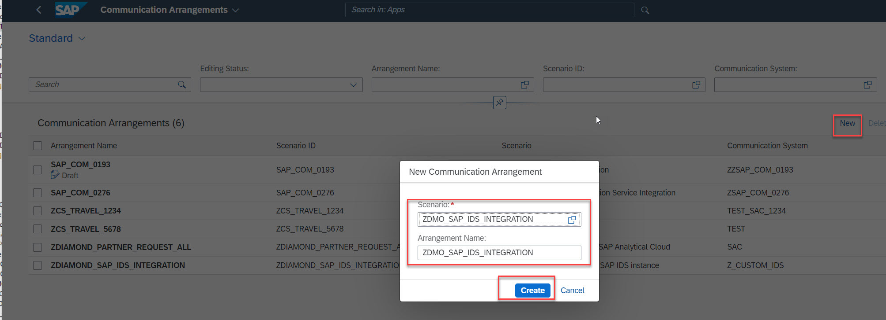
4. Use **ZDMO_SAP_IDS_INTEGRATION** also as the communication arrangement name and click **Create**
5. Select the communication system **ZDMO_IDS_INTEGRATION** that you have created before. The outbound user is selected automatically.  
   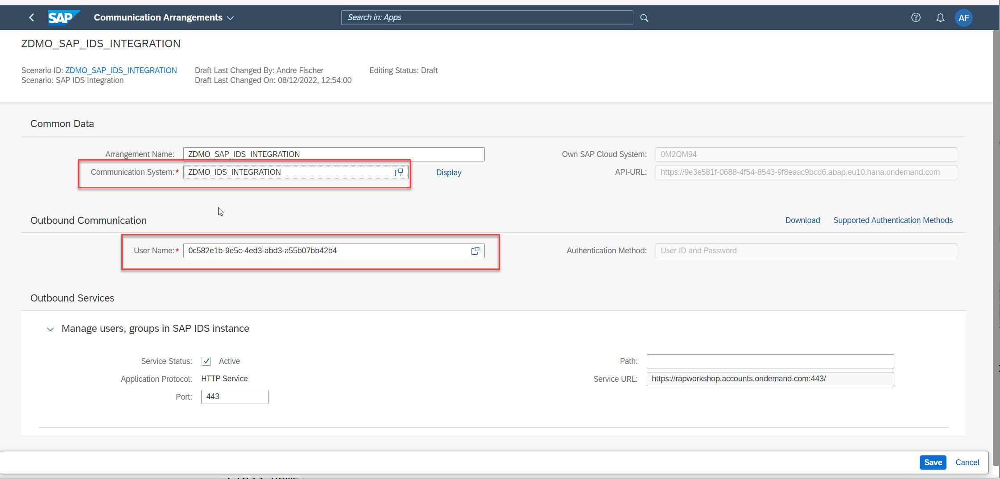 
6. Press **Save** to save your changes.  

  
# Target system details with mapping for division

<pre>
{
    "user": {
        "mappings": [
            {
                "sourcePath": "$.userName",
                "targetPath": "$.personExternalID"
            },
            {
                "sourcePath": "$.externalId",
                "optional": true,
                "targetPath": "$.personExternalID"
            },
            {
                "sourcePath": "$['urn:ietf:params:scim:schemas:extension:enterprise:2.0:User']['employeeNumber']",
                "optional": true,
                "targetPath": "$.personExternalID"
            },
            {
                "sourceVariable": "entityIdTargetSystem",
                "targetPath": "$.personID"
            },
            {
                "constant": "false",
                "targetPath": "$.markedForArchivingIndicator"
            },
            {
                "sourcePath": "$['urn:ietf:params:scim:schemas:extension:enterprise:2.0:User']['division']",
                "optional": true,
                "targetPath": "$.workplaceInformation.department"
            },
            {
                "sourcePath": "$['urn:ietf:params:scim:schemas:extension:sap:2.0:User']['userUuid']",
                "optional": true,
                "targetPath": "$.user.globalUserID"
            },
            {
                "targetPath": "$.businessPartnerRoleCode",
                "type": "valueMapping",
                "sourcePaths": [
                    "$.userType"
                ],
                "defaultValue": "BUP003",
                "valueMappings": [
                    {
                        "key": [
                            "Employee"
                        ],
                        "mappedValue": "BUP003"
                    },
                    {
                        "key": [
                            "Freelancer"
                        ],
                        "mappedValue": "BBP010"
                    },
                    {
                        "key": [
                            "Service Performer"
                        ],
                        "mappedValue": "BBP005"
                    }
                ]
            },
            {
                "sourceVariable": "currentDate",
                "targetPath": "$.validityPeriod.startDate",
                "scope": "createEntity"
            },
            {
                "constant": "9999-12-31",
                "targetPath": "$.validityPeriod.endDate",
                "scope": "createEntity"
            },
            {
                "sourceVariable": "currentDate",
                "targetPath": "$.user.validityPeriod.startDate",
                "scope": "createEntity"
            },
            {
                "constant": "9999-12-31",
                "targetPath": "$.user.validityPeriod.endDate",
                "scope": "createEntity"
            },
            {
                "sourcePath": "$.name.givenName",
                "optional": true,
                "targetPath": "$.personalInformation.firstName"
            },
            {
                "sourcePath": "$.name.familyName",
                "targetPath": "$.personalInformation.lastName"
            },
            {
                "sourcePath": "$.name.middleName",
                "optional": true,
                "targetPath": "$.personalInformation.middleName"
            },
            {
                "sourcePath": "$.name.formatted",
                "optional": true,
                "targetPath": "$.personalInformation.personFullName"
            },
            {
                "sourcePath": "$.userName",
                "targetPath": "$.user.userName"
            },
            {
                "sourcePath": "$.locale",
                "optional": true,
                "targetPath": "$.user.logonLanguageCode"
            },
            {
                "sourcePath": "$.emails[0].value",
                "optional": true,
                "targetPath": "$.workplaceInformation.emailAddress"
            },
            {
                "condition": "$.active == false",
                "constant": "true",
                "targetPath": "$.user.lockedIndicator"
            }
        ]
    },
    "group": {
        "mappings": [
            {
                "sourcePath": "$.displayName",
                "targetVariable": "entityIdTargetSystem",
                "scope": "createEntity"
            },
            {
                "sourcePath": "$.displayName",
                "targetPath": "$.displayName"
            },
            {
                "sourcePath": "$.members[*].value",
                "preserveArrayWithSingleElement": true,
                "optional": true,
                "targetPath": "$.members[?(@.value)]",
                "functions": [
                    {
                        "function": "resolveEntityIds"
                    }
                ]
            }
        ]
    }
}
</pre>
   
